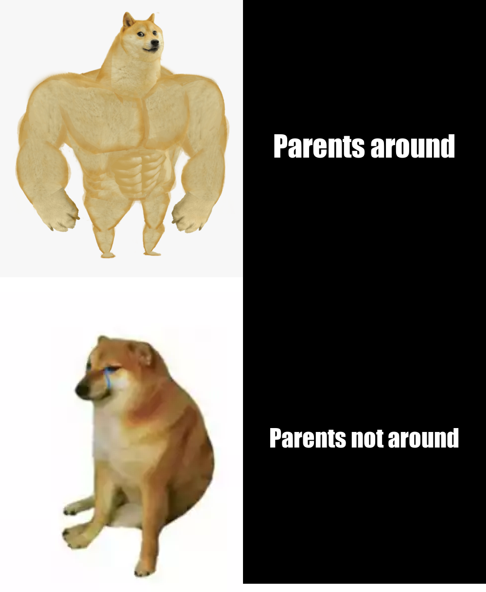

# Welcome to my web!

## Informations about me
My name is Jabin Chen and major in data science.

## Here's a small try of mine about memes
I used R package [{magick}](https://cran.r-project.org/web/packages/magick/vignettes/intro.html)

### Here is my code
```{r}
library(magick)
strong_doge <- image_read("https://www.pngitem.com/pimgs/m/202-2028426_buff-doge-hd-png-download.png") %>%
  image_scale(500)

weak_doge <- image_read("https://i.imgflip.com/45rbm3.png") %>%
  image_scale(500)

stats_text <- image_blank(width = 500, 
                       height = 600, 
                       color = "#000000") %>%
  image_annotate(text = "Parents around",
                 color = "#FFFFFF",
                 size = 60,
                 font = "Impact",
                 gravity = "center")

comp_text <- image_blank(width = 500, 
                       height = 600, 
                       color = "#000000") %>%
  image_annotate(text = "Parents not around",
                 color = "#FFFFFF",
                 size = 50,
                 font = "Impact",
                 gravity = "center")

first_row <- c(strong_doge, stats_text) %>%
  image_append()

second_row <- c(weak_doge, comp_text) %>%
  image_append()


meme <- c(first_row, second_row) %>%
  image_append(stack = TRUE)

image_write(meme, "my_meme.png")
```
### The meme 
**My original intention was that I thought that parents were the children's dependence, and that children would become stronger when they were around**

